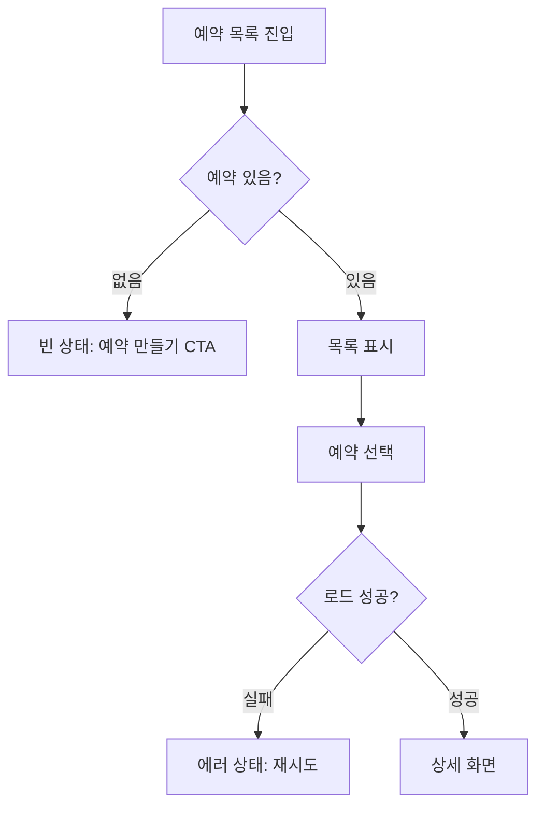

# Product Spec Playbook

Templates and quality bars for `.harness/prd.md` and the `## UX 설계` section of `.harness/design.md`. The canonical PRD section list lives in the harness-state skill — this playbook elaborates it, never diverges. Artifacts in Korean; IDs and technical terms as-is.

## 1. PRD template (`.harness/prd.md` — canonical sections per the harness-state skill)

```markdown
# PRD: <목표 한 줄>
버전: v0.x | 날짜: YYYY-MM-DD | 변경 요약: <이번 수정에서 바뀐 것>

## 1. 문제 정의
- 누가 아픈가 / 얼마나 자주 / 근거(데이터·관찰):
- 지금 해결하지 않으면:

## 2. 타겟 사용자
- 주 사용자 (최대 2):
- 이번에 대상이 아닌 사용자:

## 3. 사용자 스토리
| ID | 우선순위 | 스토리 | 인수 조건 (Given/When/Then) |
|----|----------|--------|------------------------------|
| US-001 | P0 | <역할>로서, <행동>을 하고 싶다. 그래야 <가치>를 얻는다 | Given <전제> / When <행동> / Then <검증 가능한 결과> (AC 2개 이상이면 줄바꿈으로 나열) |
(우선순위: P0 = 이번 목표 필수(must-ship) / P1 = 중요 / P2 = 여유 시)

## 4. 기능 요구사항
| ID | 요구사항 | 관련 스토리 |
|----|----------|-------------|
| FR-1 | | US-001 |

## 5. 비기능 요구사항
| ID | 요구사항 | 정량 수치 (측정 기준) |
|----|----------|------------------------|
| NFR-1 | <성능/보안/운영> | <예: p95 < 200ms> |

## 6. 스코프 컷·범위 제외
| 항목 | 안 하는 이유 | 다시 볼 시점 |
|------|-------------|-------------|

## 7. 릴리스 슬라이스
- Slice 1 (최소 수직 슬라이스): US-xxx, US-yyy — 데모 시나리오: <한 문장>
- Slice 2: ...

## 8. 규제·개인정보 체크
| 항목 | 해당 스토리 | 리스크 | 처리 방침 |
|------|------------|--------|----------|
(점검: PII/민감정보 접촉? 데이터가 서비스 경계를 벗어나는가(로그·분석·LLM API·서드파티)? 보존/삭제 정책? 동의 절차? 의료 조언/진단으로 읽힐 여지?)

## 9. 미해결 질문
| # | 질문 | 추천 기본값 | 차단 대상 |
|---|------|------------|----------|
```

## 2. User story quality — INVEST + Given/When/Then
INVEST: **I**ndependent (no hidden ordering), **N**egotiable (intent, not UI pixels), **V**aluable (user-visible value in the sentence), **E**stimable (a dev can size it), **S**mall (≤ 1 dev-day, else split), **T**estable (the Then is checkable).

G/W/T rules: Given = state, not action. When = exactly one user action. Then = observable outcome — screen content, persisted effect, or message; never implementation ("DB에 저장된다" ✗ → "새로고침해도 값이 유지된다" ✓). Each criterion must fail before the work and pass after.

좋은 예:
```
Given 로그인한 사용자가 예약이 하나도 없는 상태에서
When 예약 목록 화면에 진입하면
Then "아직 예약이 없어요" 안내와 [예약 만들기] 버튼이 표시된다
```
나쁜 예 (검증 불가·구현 지시):
```
Given 사용자가 / When 예약을 관리하면 / Then UX가 개선된다        ← 측정 불가
Then Redis 캐시에 예약이 저장된다                                  ← 구현 지시, 사용자 가치 없음
```

## 3. Prioritization — P0/P1/P2 (the only scale in artifacts)
**P0** = must-ship: Slice 1 dies without it. **P1** = important: hurts to drop but ships. **P2** = nice: only with spare time. Anything cut entirely goes into 스코프 컷·범위 제외 so it stays out. Rule: P0 total ≤ 1 dev-week for a solo developer; if P0 > 40% of stories, re-cut.

**RICE** (OPTIONAL aid — use with > 8 competing stories or disputed priorities; scores inform the P0/P1/P2 assignment and never appear in prd.md as a separate scale):
| ID | 스토리 | Reach(월 영향 사용자) | Impact(3/2/1/0.5) | Confidence(1.0/0.8/0.5) | Effort(일) | RICE = R×I×C/E |
|----|--------|----------------------|-------------------|------------------------|-----------|----------------|
| US-003 | 예약 알림 | 200 | 2 | 0.8 | 2 | 160 |
| US-007 | 테마 설정 | 300 | 0.5 | 1.0 | 3 | 50 |

Confidence below 0.5 = guessing — send the question to the analyst instead of scoring.

## 4. Release slicing patterns (solo dev)
Slice vertically (UI→API→data, demoable); never by layer. Patterns, in order of preference:
- **Walking skeleton**: thinnest end-to-end path with real integration, hardcoded where harmless. Use first, almost always.
- **Manual-first**: replace planned automation with a manual/ops step (엑셀 업로드, 수동 승인); automate later if volume proves it.
- **Single-persona**: serve only the primary persona; admin/edge roles later.
- **Read-before-write**: ship view-only first; editing is its own slice.
- **Wizard-of-Oz**: fake the smart part behind a real UI to test demand (label internally — never deceive end users about medical/health functionality).

Smell test: if Slice 1 can't be demoed to a stranger in 2 minutes, it's a layer, not a slice.

## 5. UX spec template (the `## UX 설계` section of `.harness/design.md`)

````markdown
### 1. 사용자 플로우 (US-xxx당 1개)


### 2. 정보 구조(IA)
- 화면 트리 + 내비게이션 방식 + 라우트명(kebab-case)

### 3. 화면·상태 인벤토리 (화면 × 상태, 4개 상태 필수)
| 화면 | 상태 | 조건 | 표시 내용 | 사용자 액션 | 다음 상태 |
|------|------|------|----------|------------|----------|
| 예약 목록 | loading | 요청 중 | 스켈레톤 3행 | 없음 | success/error |
| 예약 목록 | empty | 결과 0건 | "아직 예약이 없어요" + [예약 만들기] | CTA 클릭 | 예약 생성 |
| 예약 목록 | error(network) | fetch 실패 | "연결을 확인해 주세요" + [재시도] | 재시도 | loading |
| 예약 목록 | success | 1건 이상 | 예약 카드 목록 | 카드 선택 | 상세 |

### 4. 인터랙션 스펙 (컴포넌트별)
- 트리거 / 동작 / 피드백(100ms 내) / 엣지 케이스(더블 클릭, 느린 네트워크, 이탈 중 응답)

### 5. 접근성
- 플로우별 키보드 경로(탭 순서, Enter/Esc), 포커스 이동 규칙, 대비 ≥ 4.5:1, aria, 터치 타겟 ≥ 44px

### 6. UX 카피 (최종 문구)
| 키 | 문구 | 비고 |
|----|------|------|
| appointments.empty.title | 아직 예약이 없어요 | 해요체, 비난 금지 |
| appointments.error.network | 연결이 원활하지 않아요. 잠시 후 다시 시도해 주세요. | 원인+다음 행동 |
````

## 6. Review checklist — "can a developer implement this without asking questions?"
**PRD (planner self-review):**
- [ ] 성공 기준이 측정 가능한가 (지표·측정법·임계값)
- [ ] 모든 스토리가 INVEST를 통과하고 G/W/T가 2개 이상인가
- [ ] FR/NFR이 채워졌고 모든 NFR에 정량 수치가 있는가
- [ ] P0 합계가 1인 개발자 기준 ~1주 이내인가
- [ ] 스코프 컷·범위 제외가 비어 있지 않은가
- [ ] Slice 1이 수직(E2E 데모 가능)인가
- [ ] 규제/개인정보 표가 채워졌고 에스컬레이션이 열린 질문에 반영됐는가
- [ ] 열린 질문마다 추천 기본값이 있는가

**UX spec (product-designer self-review):**
- [ ] 모든 화면에 loading/empty/error/success 행이 있는가 (error는 변형별)
- [ ] prd.md의 모든 G/W/T가 최소 1개의 화면·상태 행에 매핑되는가
- [ ] 모든 에러 상태에 최종 카피가 있는가 (placeholder 금지)
- [ ] 모든 플로우가 IA에서 도달 가능한가
- [ ] 파괴적 액션마다 확인 또는 실행취소가 명시됐는가
- [ ] 새 디자인 시스템을 발명하지 않았는가

Fail any box → the document goes back for revision before handoff; questions asked downstream later are logged as spec defects in `.harness/retro/inbox.md`.
